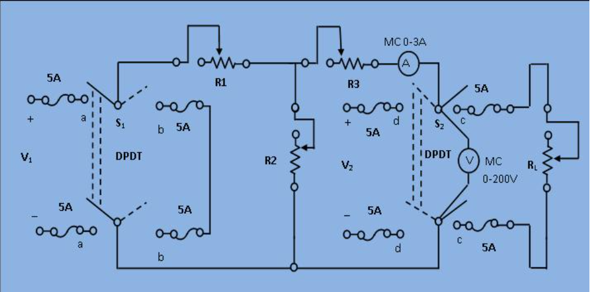

# ✅ Verification of Thevenin’s Theorem – Procedure

## 🎯 Objective
To verify Thevenin’s Theorem by calculating Thevenin voltage (Vth), Thevenin resistance (Rth), and comparing the load current from original and equivalent circuits.

---

## 🔧 Apparatus Required
- DC Voltage sources (V₁, V₂)
- Resistors (R₁, R₂, R₃, RL)
- Connecting wires
- Ammeter
- Voltmeter
- Breadboard / simulation setup
- Switches S1 and S2

---

## ⚙️ Circuit Diagram
## ⚙️ Circuit Diagram

Below is the circuit used for verification of Thevenin’s Theorem:

---

## 📋 Procedure

### 🧪 Case 1: Measure Load Current in the Original Circuit
1. Connect the circuit with all resistors (R₁, R₂, R₃, RL) and sources (V₁, V₂).
2. Set Switch **S1 = Power**, **S2 = Load**.
3. Use the ammeter to measure current through RL.
4. Record this as **Load Current (IL)**.

---

### 🧪 Case 2(a): Determine Thevenin Voltage (Vth)
1. Remove the load resistor RL.
2. Set Switch **S1 = Power**, **S2 = Intermediate**.
3. Use a voltmeter across load terminals to measure open-circuit voltage.
4. This voltage is **Thevenin Voltage (Vth)**.

---

### 🧪 Case 2(b): Determine Thevenin Resistance (Rth)
1. Replace all independent voltage sources (V₁, V₂) with short circuits.
2. Set Switch **S1 = Short**, **S2 = Power**.
3. Measure the equivalent resistance across the open load terminals.
4. This is **Thevenin Resistance (Rth)**.

---

### 🧪 Case 3: Verify with Thevenin Equivalent Circuit
1. Build Thevenin equivalent circuit with Vth in series with Rth and RL.
2. Calculate or measure the current through RL.
3. This is **Thevenin Load Current**.

---

## ✅ Conclusion
Compare the current obtained in Case 1 and Case 3.  
If both values match closely, **Thevenin’s theorem is verified**.

